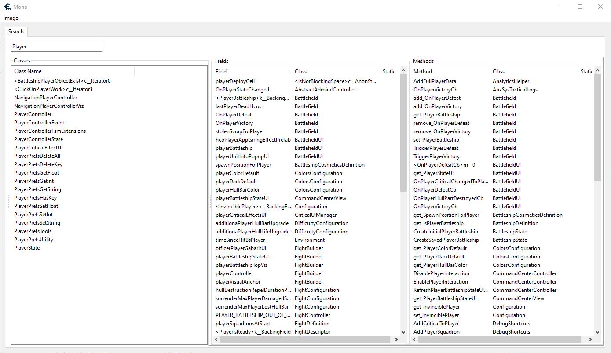
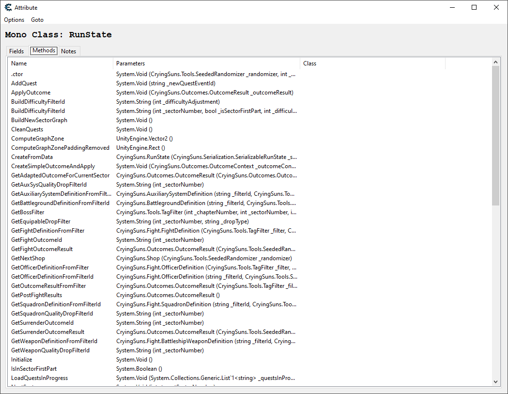

## Quick Start

Open the 'Dev.CT' table and copy the 'MonoHelper' entry to your own table.
Activate it when attached to a game that uses mono and use the new
menu option Mono->Search.

## Quick Build

Source code is split into lua files in the `src/lua` directory
with forms in the `src/forms` directory.

1. Open Cheat Engine (do not double click file to open)
2. Using File->Open, open the table 'Dev.CT' (so that directory is set)
3. Allow the table script to run to create the `Dev (MonoHelper)` menu
4. Click `Dev (MonoHelper)`->`Build and create table entry`
5. Copy the new table entry and paste it into your own table

## Cheat Engine Mono Helper

There have been some advances with more recent versions of Cheat Engine,
but this will create some forms that I think make it easier to find
classes and functions in games that use Mono.

The search pre-processes a single image, which defaults to 'Assembly-CSharp',
so do 'Select Image' to pick a different one:


Use the new 'Mono->Search' menu and start typing to show Classes, Fields,
and Methods that contain your text.   Double-clicking on any will open
a 'Class' window.



In the 'Class' window you can see fields and methods.  Right-clicking on
a method gives you a few options:

1. Hook - Create an injection script for the start of the method
2. Disassemble - jump to the method in the disassembler
3. Create Table Script - Creates table entry hooking the start of the method with a counter for number of times executed and storing the most recent object pointer and parameter values



## Hooking a method

Double-clicking a method in the Class window will goto the method's address in
the disassembly window and open up an auto-assembly window with code to hook
into the start of the method.  For example in Crying Suns you can search for
'IsConnectedTo' and double-click on the method in the search window to open
up the NavigationSystem class it belongs to.  Then double-clicking on the method
there will create this script:

```
define(hook,"CryingSuns.Navigation:NavigationSystem:IsConnectedTo")
define(bytes,55 48 8B EC 56)

[enable]

assert(hook, bytes)
alloc(newmem,$1000, hook)
{
  RCX: NavigationSystem (this)
  RDX: CryingSuns.Navigation.NavigationSystem _system

  Returns (RAX) System.Boolean
}

newmem:
  // original code
  push rbp
  mov rbp,rsp
  push rsi
  jmp hook+5

hook:
  jmp newmem

[disable]

hook:
  db bytes

dealloc(newmem)
```

You can replace the original code with this to return true so that you can jump from one system to another:

```
mov rax,1
ret
```

## Static Fields

The script "Register Statics" shows how to register static fields as symbols so you can use them
in your code or in table values.  Here it registers `CryingSuns:GameState:currentRunState` which
is an easy way to find the player state with fuel, commandos, and scrap:

```
[enable]
{$lua}
unregisterSymbol("CryingSuns:GameState:currentRunState")
LaunchMonoDataCollector()
local class = mono_findClass("CryingSuns", "GameState")
for i,f in ipairs(mono_class_enumFields(class)) do
  if f.isStatic and f.name == "currentRunState" then
    registerSymbol("CryingSuns:GameState:currentRunState", mono_class_getStaticFieldAddress(mono_enumDomains()[1], class) + f.offset, true)
    break
  end
end
{$asm}

[disable]
{$lua}
unregisterSymbol("CryingSuns:GameState:currentRunState")
{$asm}
```

## Building `autorun/monohelper.lua`

See [`/docs/Building.md`](/docs/Building.md)


## What I'd like to do in the future:

* Detect/show what are enums
* Right-click class to find instances
* Right-click to create code to find statics
* Show method arguments and return values (method window?)
* Right-click to inject at start of method
    * Create AA script that will inject at start, have comments showing arguments and register/stack locations
* Implement notes on class, method, field
* Notes window showing all notes
* ...