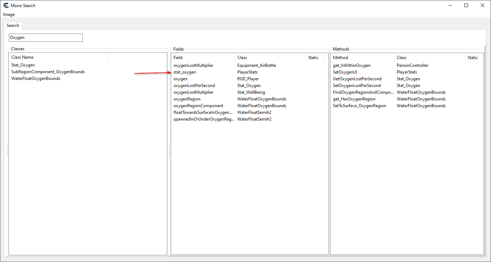
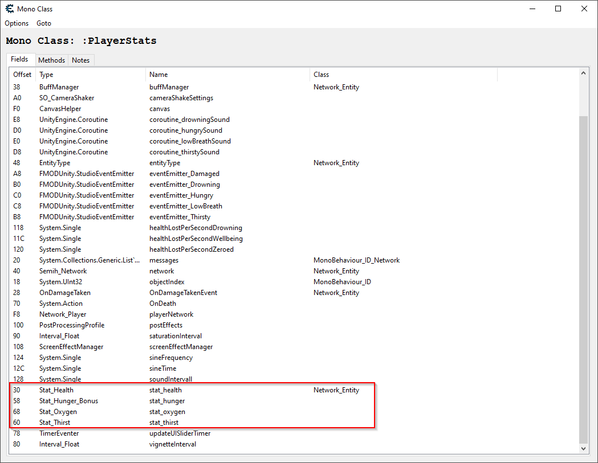
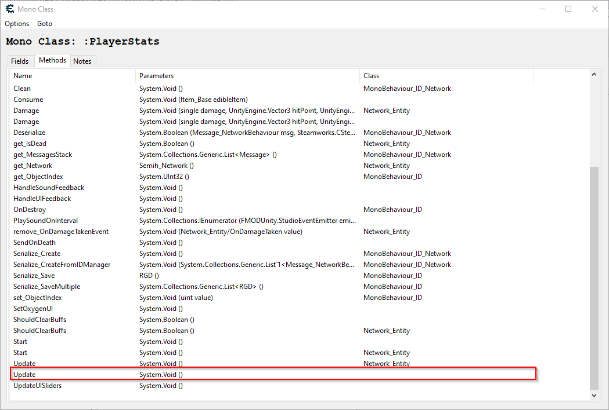
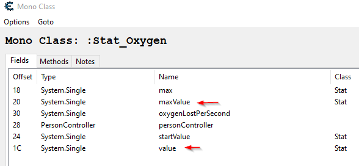

# Raft tutorial

Ensure you have [monohelper.lua](../../Releases/monohelper.lua) saved to your Cheat Engine 'autorun' directory.
Open up cheat engine and connect to your Raft game instance.

You should see the normal cheat engine 'Mono' menu appear, but it will have a new 'Search' option at the bottom.

Clicking the 'Search' menu item will display the image select window and automatically select the game's
assembly because it uses the standard name 'Assembly-CSharp' and open the 'Mono Search' window.

Start typing 'Oxygen' in the box.  As you type the lists will be filtered to
classes, fields, and methods that contain what you're typing.  There are some
interesting things.  There's a seperate 'Stat_Oxygen' class, but what looks really
interesting is the 'stat_oxygen' field on the 'PlayerStats' class.



Double-click on this to open a window with the 'PlayerStats' class.  Click on the
'Options' menu and check 'Include Inherited' to see fields and methods from base
classes also.  Here we see that there are other stats with their own classes for
hunger and thirst also, along with health that is inherited from 'Network_Entity'.
That's very interesting because that means there are probably other entities
with health besides players, probably enemies.



Let's concentrate on oxygen for now though.  Remember the offset is 68 for stat_oxygen.
Change to the 'Methods' tab and we see some cool thigns such as 'Damage()' which exists
on both PlayerStats and Network_Entity.  Those might be handy for god mode and one hit
kill cheats.  For now though look down to find the 'Update' method.  Methods like this
are usually frequenly updated to do housekeeping on the object.  

Double-click the update method without text in the 'Class' column, this means it's
directly on the PlayerStats class and not on a parent class.  We don't want to be
changing oxygen for enemies, and in fact the stat doesn't exist so that might
crash the game.



This changes the code address in the memory viewer to the method's start and opens an
auto assemble window with an injection script.  This doesn't do anything at the moment
but jump to relocated code and jump back, but save it to the table (File->Assign to
current cheat table) and close the window, then rename it in the table and open the 
table version of the script back up:

> TODO: Either automatically or have a right-click option to do this automatically

```asm
define(hook,"PlayerStats:Update")
define(bytes,55 48 8B EC 48 83 EC 60)

[enable]

assert(hook, bytes)
alloc(newmem,$1000, hook)
{
  RCX: PlayerStats (this)

  Returns (RAX) System.Void
}

newmem:
  // original code
  push rbp
  mov rbp,rsp
  sub rsp,60
  jmp hook+8

hook:
  jmp newmem

[disable]

hook:
  db bytes

dealloc(newmem)
```

Notice the comment tells you what registers are passed and what types they are along
with the expected return type.  This only shows the int registers for parameters (RCX,
RDX, R8, R9), if any parameters are floats they will actually be xmm0-xmm3.  For
class methods RCX is always the instance the method is called on.  Say there is a second
parameter and it's a float, that would actually be XMM2 and not R8.

Well, we know that `stats_oxygen` is of type Stat_Oxygen and at offset +68, so go back to
the search window double-click  'Stat_Oxygen' in the Classes panel to open it and switch
to the fields tab.  You can see there's a float 'value' at offset 1C and a 'maxValue'
float at offset 20:



We can change our script now to change `value` to `maxValue` every time Update() is called,
which is frequently:

```asm
define(hook,"PlayerStats:Update")
define(bytes,55 48 8B EC 48 83 EC 60)

[enable]

assert(hook, bytes)
alloc(newmem,$1000, hook)
{
  RCX: PlayerStats (this)

  Returns (RAX) System.Void
}

newmem:
  // cheat: maximize oxygen every time PlayerStats.Update() is called
  push rax // save rax
  push rbx // save rbx
  mov rax,[rcx+68] // load pointer at PlayerStats.stat_oxygen into rax
  test rax,rax // is it zero?
  jz @f // jump forward to nearest @@ label to prevent null pointer error
  mov ebx, [rax+20] // load Stats_Oxygen.maxValue into ebx
  mov [rax+1C], ebx // save as Stats_Oxygen.value
@@: // temp label for jz @f earlier
  pop rbx // restore rbx
  pop rax // restore rax

  // original code
  push rbp
  mov rbp,rsp
  sub rsp,60
  jmp hook+8

hook:
  jmp newmem

[disable]

hook:
  db bytes

dealloc(newmem)
```

Activate this script and you will never run out of oxygen.  The table I created for
this tutorial is here:

[Raft.CT](Raft.CT])
